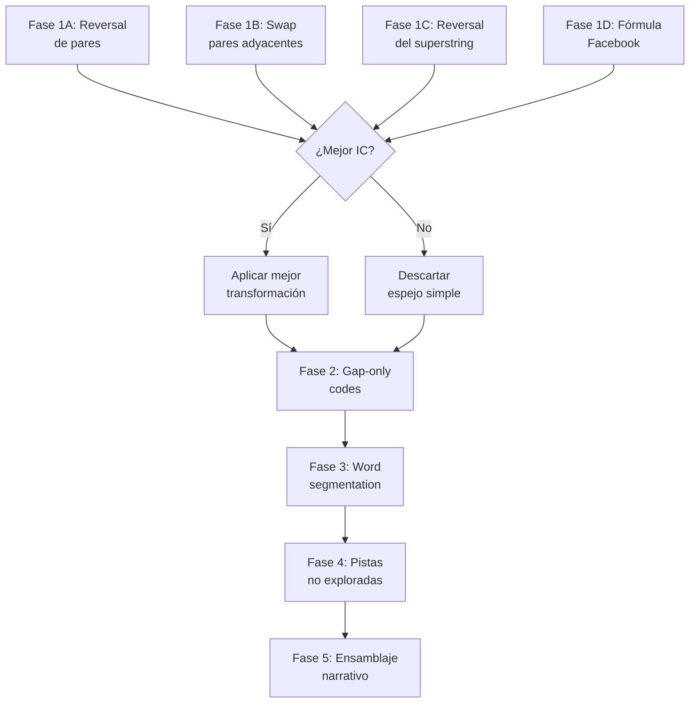

# Plan de Resolución del Cifrado 469 (Bonelord Language)

## Objetivo
Decodificar el texto completo de los 70 libros de Hellgate utilizando todas las pistas disponibles, con énfasis en la **hipótesis del espejo** y las pistas no exploradas encontradas en videos de YouTube.

---

## Evidencia del Espejo — Por qué es prometedor

La temática del espejo/reflejo aparece **5 veces** en el universo del 469:

| Pista | Fuente | Implicación |
|-------|--------|-------------|
| **Facebook Post oficial de CipSoft**: imagen espejada con pares numéricos | docs/README-469.md | Los números EN el espejo siguen R = 0.593L + 25.28 |
| **Cuarto espejado** en Paradox Tower (del creador del 469) con libros que podrían ser la clave | docs/README-469.md | La clave del cifrado podría estar en esos libros |
| **TOTNIURG** = GRUINTOT al revés (GRUIN+TOT = ruina+muerte en alemán) | FINDINGS.md §8.6 | ¡El texto mismo contiene palabras invertidas! |
| **Bonelords ven los parpadeos del otro "espejados"** | docs/README-469.md | Cuando un bonelord "lee" a otro, recibe la señal invertida |
| **Libro de Kharos** = reorganización por bloques alternos del libro de Hellgate | FINDINGS.md §8 | Transposición de bloques, como si se intercalaran |

> [!IMPORTANT]
> CipSoft puso un espejo literal en la pista más directa que han dado (el Facebook post). Además, el cuarto espejado de la Paradox Tower contiene libros con letras que podrían ser una tabla de lookup del cifrado (uno con 26 secciones = tamaño del alfabeto).

---

## Propuesta: 5 Fases de Ataque

---

### Fase 1: Hipótesis del Espejo 🪞

Probaremos 4 transformaciones de espejo sobre los datos:

#### 1A. Reversión de dígitos individuales dentro de cada par

```
Original:  95 61 19 80 03 64 ...
Espejado:  59 16 91 08 30 46 ...
```
- Tomar cada par de 2 dígitos y invertir los dígitos.
- Evaluar si las frecuencias del texto espejado se alinean mejor con alemán.
- Medir IC del texto transformado vs original.

#### 1B. Intercambio de pares adyacentes

```
Original:  [95][61][19][80][03][64] ...
Espejado:  [61][95][80][19][64][03] ...
```
- Swap posiciones pares ↔ impares.
- Evaluar coherencia del texto resultante.

#### 1C. Reversión completa del superstring

```
Original:  9561198003645612...
Reverso:   ...2165460038911659
Re-emparejado: ...21 65 46 00 38 91 16 59
```
- Los bonelords leen de derecha a izquierda (por la simetría visual de los parpadeos).
- Decodificar el superstring al revés y comparar coherencia.

#### 1D. Transformación Facebook: R = floor(0.593*L + 25.28) aplicada a cada par

```
Para código XY (valor numérico):
  código_espejo = round(0.593 * XY + 25.28)
```
- Aplicar la fórmula del Facebook post a cada código de 2 dígitos.
- Si código 95 → round(0.593*95 + 25.28) = round(81.6) = 82. Así `95` se mapea a `82`.
- Generar la tabla de mapeo completa (100 entradas) y ver si produce mejor texto.

#### [NEW] `agente3/scripts/fase1_espejos.py`

Script que implementa las 4 transformaciones y mide:
- Índice de Coincidencia (IC) del texto transformado
- Porcentaje de bigramas alemanes válidos (top-25)
- Score de parseo con diccionario alemán (DP word segmentation)

---

### Fase 2: Reasignación de los 20 Códigos Gap-Only 🔧

Los 20 códigos que NUNCA aparecen en palabras alemanas confirmadas concentran ~700 ocurrencias. Son los candidatos más probables a estar mal asignados.

#### 2A. Análisis de contexto de bigramas

Para cada código gap-only, analizar qué bigramas forma con sus vecinos:
- Si `[64]=T(124x)` siempre forma bigramas imposibles en alemán (ej: TT_, _TT, TH siempre falla) → está mal asignado.
- Generar tabla de bigramas por código gap-only y comparar con frecuencias de bigramas alemanes.

#### 2B. Reasignación con restricciones

- **Proteger** los 40 códigos ancla (confirmados en URALTE, KOENIG, EINEN, etc.).
- Probar asignar gap-only codes a letras sub-representadas: M, O, B, F, P, V, K, Z.
- Para cada reasignación candidata, medir mejora en score de parseo alemán.

#### [NEW] `agente3/scripts/fase2_gap_analysis.py`

---

### Fase 3: Segmentación por Libros Pares (método YouTube) 📖

El video de Expedientes Tibianos X revela que los 9 pares de libros con contenido compartido pueden usarse para encontrar fronteras de palabras.

#### 3A. Identificar los 9 pares

- Comparar todos los 70 libros entre sí buscando sub-secuencias compartidas de ≥6 dígitos.
- Encontrar los pares donde TODOS los códigos de uno aparecen en el otro (pero en distinto orden).

#### 3B. Extraer glosario de "palabras 469"

- De cada par, extraer las unidades mínimas que se repiten intactas.
- Construir un glosario: `{código_469: longitud_en_dígitos}`.
- Caso especial: Libros Lib16↔Lib17 donde contenido aparece 2×.

#### 3C. Segmentar los otros 54 libros

- Usar el glosario para dividir los libros restantes en unidades de palabras.
- Cada "palabra 469" se decodifica con el mapeo v4 y se compara contra diccionario alemán.

#### [NEW] `agente3/scripts/fase3_word_segmentation.py`

---

### Fase 4: Pistas No Exploradas 🔍

#### 4A. Libros de Paradox Tower como lookup table

```
ljkhbl nilse jfpce ojvco ld        ← ¿26 secciones = 26 letras?
slcld ylddiv dnolsd dd sd
...
```

- El libro tiene **26 secciones** (= tamaño del alfabeto).
- Las letras del libro podrían mapear a los dígitos del 469.
- Intento: Asignar cada sección a una letra (A-Z) y buscar si las letras del libro crean algún mapeo con los códigos.

#### 4B. "Surreal Numbers" del NPC Prisioneiro

- Investigar si los "números surrealistas" (teoría matemática de Conway/Knuth) tienen alguna aplicación criptográfica.
- Los surreal numbers usan una notación de pares {L|R} — ¿como pares de dígitos?

#### 4C. Cifra Nihilista con clave "469"

- La cifra nihilista usa una cuadrícula Polybius + una clave numérica.
- Probar con clave `469` y el cuadrado Polybius 5×5 (o 10×10 para dígitos).
- También probar Vigenère con clave `469`.

#### 4D. Fórmula del Facebook: ¿función de hash?

La función R = 0.593*L + 25.28 (R²=0.990) con 26 pares podría ser:
- Una función de mapeo entre "blinking" y "writing" (lo que se parpadea → lo que se escribe).
- Un sistema de corrección de errores.
- Una función de coeficiente 3/5 (3 ojos internos / 5 ojos totales).

#### [NEW] `agente3/scripts/fase4_nuevas_pistas.py`

---

### Fase 5: Ensamblaje Narrativo 📜

Una vez que las fases 1-4 mejoren el mapeo:

#### 5A. Re-decodificar el superstring completo

- Aplicar el mapeo mejorado al superstring de 5,902 dígitos.
- Segmentar usando las fronteras de palabras de la Fase 3.
- Identificar oraciones completas en alemán.

#### 5B. Conectar cadenas 0 y 2

- Cadena 0 (URALTE, sin KOENIG) + Cadena 2 (KOENIG, sin URALTE).
- Buscar libros intermedios que compartan contenido con ambas cadenas.

#### 5C. Verificación con cribs conocidos

- El saludo de Chayenne (EN los libros) debería decodificarse coherentemente.
- Los saludos del Wrinkled Bonelord (EN los libros) deberían dar frases coherentes.
- El segmento "DERKOENIG" debería ser consistente en todas sus apariciones.

---

## Orden de Ejecución



---

## Verificación

### Tests automáticos
Cada script generará métricas comparativas:
- **IC** (Índice de Coincidencia): Esperado para alemán = 1.72 a nivel de par
- **Bigram Score**: % de bigramas top-25 que coinciden con alemán
- **Word Parse %**: % del texto que se parsea como palabras alemanas válidas (actual: 67.2%)
- **Gap-only reduction**: Cuántos de los 20 gap-only codes producen ahora bigramas válidos

### Criterio de éxito
- Cualquier transformación de Fase 1 que mejore Word Parse % en >5% es significativa
- Si Fase 2 reduce gap-only codes de 20 a <10, es un avance importante
- Si Fase 3 produce un glosario de >30 "palabras 469" distintas, confirma la estructura
- Victoria final: >85% del texto parseable como alemán con oraciones coherentes

---

## Archivos a crear (todos en `agente3/scripts/`)

| Script | Función |
|--------|---------|
| `fase1_espejos.py` | 4 transformaciones de espejo + métricas |
| `fase2_gap_analysis.py` | Análisis y reasignación de 20 gap-only codes |
| `fase3_word_segmentation.py` | Segmentación por libros pares |
| `fase4_nuevas_pistas.py` | Paradox Tower lookup, Nihilista, Vigenère |
| `utils_469.py` | Funciones compartidas: cargar datos, IC, parseo alemán |
| `run_all.py` | Ejecutar todas las fases y generar reporte |
